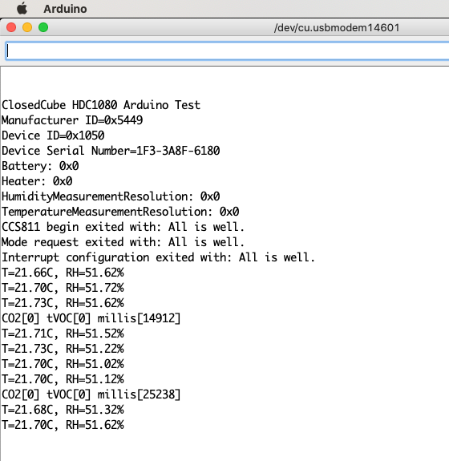
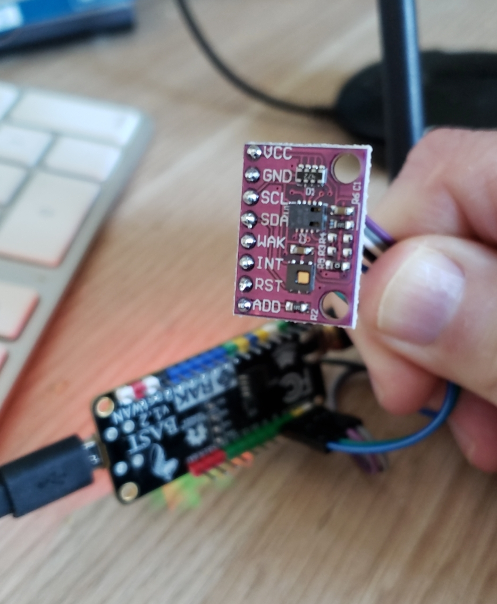

# BastWAN_HDC1080_CCS811_demo

This project uses a CJMCU-8118 board bought on Taobao, hosting an HDC1080 humidity and temperature sensor and a CCS811 digital gas sensor. It requires the usual 4 pins for I2C, plus 2 pins for INTerrupt and WAKe for the CCS811 (should you want to use an interrupt-based code, as opposed to straight readings).

You will need two libraries, from ClosedCube and Sparkfun.

```c
#include <ClosedCube_HDC1080.h>
// Click here to get the library: http://librarymanager/All#ClosedCube_HDC1080
#include <SparkFunCCS811.h>
// Click here to get the library: http://librarymanager/All#SparkFun_CCS811
```

By default the HDC1080 is set to 14-bit resolution for Temperature and Humidity. You can play with the registers by setting the proper bits in `HDC1080_Registers`:

```c
    typedef union {
    uint8_t rawData;
    struct {
    uint8_t HumidityMeasurementResolution : 2;
      //00: 14-bit
      //01: 11-bit
      //10:  8-bit
    uint8_t TemperatureMeasurementResolution : 1;
      //0: 14-bit
      //1: 11-bit
    uint8_t BatteryStatus : 1;
      //0: Battery voltage > 2.8V (read only)
      //1: Battery voltage < 2.8V (read only)
    uint8_t ModeOfAcquisition : 1;
      //0: Temp *or* RH
      //1: Both
    uint8_t Heater : 1;
      //0: Disabled
      //1: Enabled
    uint8_t ReservedAgain : 1;
    uint8_t SoftwareReset : 1;
      //0: Normal Operation, this bit self-clears
      //1: Software Reset
    };
    } HDC1080_Registers;
```

See [this PDF](https://www.ti.com/lit/ds/symlink/hdc1080.pdf?ts=1610434595877&ref_url=https%253A%252F%252Fwww.google.com%252F) for more details.

Use this function to set the register:

    void writeRegister(HDC1080_Registers reg);

I added some code in `setup()` to show how to read the configuration and look under the hood:

```c
  HDC1080_Registers reg = hdc1080.readRegister();
  Serial.print("Battery: 0x");
  Serial.println(reg.BatteryStatus, HEX);
  Serial.print("Heater: 0x");
  Serial.println(reg.Heater, HEX);
  Serial.print("HumidityMeasurementResolution: 0x");
  Serial.println(reg.HumidityMeasurementResolution, HEX);
  Serial.print("TemperatureMeasurementResolution: 0x");
  Serial.println(reg.TemperatureMeasurementResolution, HEX);
```

This confirms the default settings:



```c
Battery: 0x0
Heater: 0x0
HumidityMeasurementResolution: 0x0
TemperatureMeasurementResolution: 0x0
```


